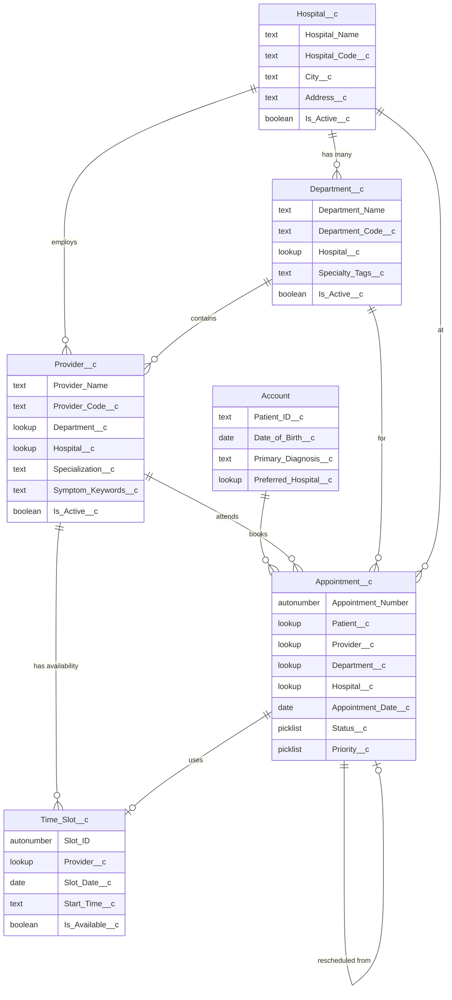

# Feature 1: Health Cloud Data Setup

## 📚 1. Concept Explanation

**What we are building:**
The data foundation for the entire Patient Scheduling Agent. Think of this as the "database blueprint" — without it, the AI agent has no patients to look up, no doctors to recommend, and no appointments to book.

**Why it matters:**
- Health Cloud provides healthcare-specific standard objects (Account as Patient, Contact, Care Plan, etc.)
- We extend these with custom objects for our scheduling use case
- Proper data modeling = fast queries, clean AI responses, and a professional demo

**What you will have after this step:**
- A complete data model with Hospitals, Departments, Providers (Doctors), Patients, and Appointments
- Sample data loaded and ready to use
- Relationships between all objects so the AI can traverse data intelligently

---

## 🏗️ 2. Salesforce Setup Steps

### Step 2.1: Enable Health Cloud (if not already enabled)

1. Go to **Setup** (gear icon → Setup)
2. In the Quick Find box, type **"Health Cloud"**
3. Click **Health Cloud Settings**
4. Toggle **Enable Health Cloud** → ON
5. Click **Save**

> [!NOTE]
> If you're on a Developer Edition, Health Cloud may need to be enabled via a trial or separate license. If unavailable, you can still build the data model using custom objects — the guide will note alternatives.

### Step 2.2: Understand the Standard Objects We'll Use

Health Cloud provides these standard objects out of the box:

| Standard Object | Our Usage | Notes |
|----------------|-----------|-------|
| **Account** (Person Account) | Patient record | Enable Person Accounts for patient data |
| **Contact** | Patient contact info | Linked to Account |
| **User** | Salesforce users / agents | Internal staff |

### Step 2.3: Enable Person Accounts

Person Accounts let us treat an Account as an individual person (patient) rather than a business.

1. Go to **Setup** → Quick Find → **"Account Settings"**
2. Look for **"Allow Person Accounts"** — if you see it, enable it
3. If not visible, you need to contact Salesforce support or use a Record Type workaround

> [!TIP]
> **Workaround if Person Accounts aren't available:** Create a Record Type called "Patient" on the standard Account object and add patient-specific fields there. This works for demo purposes.

---

### Step 2.4: Create Custom Objects

We need **4 custom objects**. Here's exactly how to create each one:

---

#### 🏥 Custom Object 1: `Hospital__c`

**Purpose:** Represents each hospital in the Onco Global network.

**Steps to create:**
1. Go to **Setup** → Quick Find → **"Object Manager"**
2. Click **Create** → **Custom Object**
3. Fill in:
   - **Label:** `Hospital`
   - **Plural Label:** `Hospitals`
   - **Object Name:** `Hospital` (auto-fills as `Hospital__c`)
   - **Record Name:** `Hospital Name` (Data Type: Text)
   - ✅ Check **Allow Reports**
   - ✅ Check **Allow Activities**
   - ✅ Check **Track Field History**
   - ✅ Check **Allow in Chatter Groups**
   - ✅ Check **Allow Search**
4. Under **Object-Level Help**, leave blank
5. Under **Deployment Status**, select **Deployed**
6. Click **Save**

**Now add fields to Hospital__c:**

| Field Label | API Name | Data Type | Required | Description |
|------------|----------|-----------|----------|-------------|
| Hospital Code | `Hospital_Code__c` | Text(10) | ✅ Yes | Unique code like `HOSP-001` |
| City | `City__c` | Text(100) | ✅ Yes | City where hospital is located |
| State | `State__c` | Text(100) | No | State/Province |
| Address | `Address__c` | Text Area(255) | No | Full street address |
| Phone | `Phone__c` | Phone | No | Main hospital phone number |
| Email | `Email__c` | Email | No | General hospital email |
| Is Active | `Is_Active__c` | Checkbox | No | Default: TRUE |
| Total Beds | `Total_Beds__c` | Number(5,0) | No | Total bed capacity |
| Operating Hours | `Operating_Hours__c` | Text(100) | No | e.g., "Mon-Sat 8AM-8PM" |
| Latitude | `Latitude__c` | Number(10,6) | No | For location-based features |
| Longitude | `Longitude__c` | Number(10,6) | No | For location-based features |

**How to add a field:**
1. Inside **Object Manager** → **Hospital__c** → click **Fields & Relationships**
2. Click **New**
3. Select the Data Type from the table above → **Next**
4. Enter the Field Label and Field Name → **Next**
5. Set field-level security (visible to all profiles) → **Next**
6. Add to page layout → **Save**

Repeat for each field.

---

#### 🏬 Custom Object 2: `Department__c`

**Purpose:** Represents medical departments within hospitals (Oncology, Radiology, Surgery, etc.)

**Create the object:**
1. **Setup** → **Object Manager** → **Create** → **Custom Object**
2. Fill in:
   - **Label:** `Department`
   - **Plural Label:** `Departments`
   - **Object Name:** `Department`
   - **Record Name:** `Department Name` (Text)
   - ✅ Allow Reports, Activities, Search
   - **Deployment Status:** Deployed
3. Click **Save**

**Fields for Department__c:**

| Field Label | API Name | Data Type | Required | Description |
|------------|----------|-----------|----------|-------------|
| Department Code | `Department_Code__c` | Text(10) | ✅ Yes | e.g., `ONCO`, `RADIO` |
| Hospital | `Hospital__c` | Lookup(Hospital__c) | ✅ Yes | Which hospital this dept belongs to |
| Description | `Description__c` | Text Area(Long) | No | What this department treats |
| Head of Department | `Head_of_Department__c` | Text(100) | No | Name of the department head |
| Is Active | `Is_Active__c` | Checkbox | No | Default: TRUE |
| Floor/Wing | `Floor_Wing__c` | Text(50) | No | Physical location in hospital |
| Specialty Tags | `Specialty_Tags__c` | Text Area(500) | No | Comma-separated: "breast cancer, lung cancer, chemotherapy" |
| Average Wait Time (mins) | `Avg_Wait_Time__c` | Number(4,0) | No | Helps with slot optimization |

> [!IMPORTANT]
> The **Hospital** field is a **Lookup relationship** to `Hospital__c`. This means each Department belongs to one Hospital. When creating this field:
> - Select Data Type: **Lookup Relationship**
> - Related To: **Hospital**
> - Field Label: **Hospital**
> - This will auto-create `Hospital__c` as the API name

---

#### 👨‍⚕️ Custom Object 3: `Provider__c`

**Purpose:** Represents doctors/practitioners in the system.

> [!NOTE]
> Health Cloud has a standard `HealthcareProvider` object. However, for easier customization in a hackathon, we'll create a custom `Provider__c` object. If you prefer using the standard one, the fields map similarly.

**Create the object:**
1. **Setup** → **Object Manager** → **Create** → **Custom Object**
2. Fill in:
   - **Label:** `Provider`
   - **Plural Label:** `Providers`
   - **Object Name:** `Provider`
   - **Record Name:** `Provider Name` (Text)
   - ✅ Allow Reports, Activities, Search
   - **Deployment Status:** Deployed
3. Click **Save**

**Fields for Provider__c:**

| Field Label | API Name | Data Type | Required | Description |
|------------|----------|-----------|----------|-------------|
| Provider Code | `Provider_Code__c` | Text(10) | ✅ Yes | e.g., `DOC-001` |
| Department | `Department__c` | Lookup(Department__c) | ✅ Yes | Which department they belong to |
| Hospital | `Hospital__c` | Lookup(Hospital__c) | ✅ Yes | Which hospital they practice at |
| Specialization | `Specialization__c` | Text(200) | ✅ Yes | e.g., "Medical Oncology" |
| Qualification | `Qualification__c` | Text(200) | No | e.g., "MD, DM (Oncology), FASCO" |
| Experience Years | `Experience_Years__c` | Number(2,0) | No | Years of experience |
| Email | `Email__c` | Email | No | Doctor's email |
| Phone | `Phone__c` | Phone | No | Doctor's direct number |
| Is Active | `Is_Active__c` | Checkbox | No | Default: TRUE |
| Is Available Today | `Is_Available_Today__c` | Checkbox | No | Quick flag for availability |
| Rating | `Rating__c` | Number(2,1) | No | Patient rating out of 5.0 |
| Consultation Fee | `Consultation_Fee__c` | Currency(8,2) | No | Fee per visit |
| Languages Spoken | `Languages_Spoken__c` | Text(200) | No | e.g., "English, Hindi, Tamil" |
| Max Daily Appointments | `Max_Daily_Appointments__c` | Number(3,0) | No | Capacity limit per day |
| Bio | `Bio__c` | Text Area(Long) | No | Short bio for patient-facing display |
| Profile Photo URL | `Profile_Photo_URL__c` | URL | No | Link to doctor's photo |
| Symptom Keywords | `Symptom_Keywords__c` | Text Area(Long) | No | Keywords for AI matching: "headache, migraine, tumor, brain cancer" |

---

#### 📅 Custom Object 4: `Appointment__c`

**Purpose:** The core scheduling object — every booking, reschedule, and cancellation lives here.

**Create the object:**
1. **Setup** → **Object Manager** → **Create** → **Custom Object**
2. Fill in:
   - **Label:** `Appointment`
   - **Plural Label:** `Appointments`
   - **Object Name:** `Appointment`
   - **Record Name:** `Appointment Number` (Auto Number, format: `APT-{0000}`)
   - ✅ Allow Reports, Activities, Search, Track Field History
   - **Deployment Status:** Deployed
3. Click **Save**

> [!TIP]
> Using **Auto Number** for the Record Name means every appointment gets a unique ID like `APT-0001`, `APT-0002`, etc. — very professional for demos!

**Fields for Appointment__c:**

| Field Label | API Name | Data Type | Required | Description |
|------------|----------|-----------|----------|-------------|
| Patient | `Patient__c` | Lookup(Account) | ✅ Yes | The patient (Person Account) |
| Provider | `Provider__c` | Lookup(Provider__c) | ✅ Yes | The assigned doctor |
| Department | `Department__c` | Lookup(Department__c) | ✅ Yes | Department for the visit |
| Hospital | `Hospital__c` | Lookup(Hospital__c) | ✅ Yes | Which hospital |
| Appointment Date | `Appointment_Date__c` | Date | ✅ Yes | Date of appointment |
| Appointment Time | `Appointment_Time__c` | Text(10) | ✅ Yes | e.g., "10:30 AM" |
| Start DateTime | `Start_DateTime__c` | Date/Time | No | Precise start (for slot logic) |
| End DateTime | `End_DateTime__c` | Date/Time | No | Precise end (for slot logic) |
| Duration (mins) | `Duration__c` | Number(3,0) | No | Default: 30 |
| Status | `Status__c` | Picklist | ✅ Yes | See values below |
| Type | `Type__c` | Picklist | No | See values below |
| Priority | `Priority__c` | Picklist | No | See values below |
| Reason for Visit | `Reason_for_Visit__c` | Text Area(500) | No | Patient's stated reason |
| Symptoms | `Symptoms__c` | Text Area(Long) | No | AI-captured symptoms |
| Notes | `Notes__c` | Text Area(Long) | No | Doctor/staff notes |
| Is First Visit | `Is_First_Visit__c` | Checkbox | No | First time patient? |
| Reminder Sent | `Reminder_Sent__c` | Checkbox | No | Has reminder been sent? |
| Confirmation Status | `Confirmation_Status__c` | Picklist | No | Pending, Confirmed, Unconfirmed |
| No Show Count | `No_Show_Count__c` | Number(3,0) | No | Historical no-shows for this patient |
| Cancellation Reason | `Cancellation_Reason__c` | Text Area(500) | No | Why was it cancelled? |
| Rescheduled From | `Rescheduled_From__c` | Lookup(Appointment__c) | No | Link to original appointment |
| Source Channel | `Source_Channel__c` | Picklist | No | Web Chat, WhatsApp, SMS, Phone |
| Language Preference | `Language_Preference__c` | Picklist | No | English, Hindi, Hinglish |

**Picklist Values:**

**Status__c:**
- `Scheduled`
- `Confirmed`
- `Checked In`
- `In Progress`
- `Completed`
- `Cancelled`
- `No Show`
- `Rescheduled`

**Type__c:**
- `New Consultation`
- `Follow-up`
- `Emergency`
- `Lab/Diagnostics`
- `Chemotherapy`
- `Radiation`
- `Surgery Pre-op`
- `Second Opinion`

**Priority__c:**
- `Normal`
- `High`
- `Urgent`
- `Emergency`

**Source_Channel__c:**
- `Web Chat`
- `WhatsApp`
- `SMS`
- `Phone`
- `Walk-in`
- `Agent Portal`

**Confirmation_Status__c:**
- `Pending`
- `Confirmed`
- `Unconfirmed`

**Language_Preference__c:**
- `English`
- `Hindi`
- `Hinglish`

---

### Step 2.5: Add Patient-Specific Fields to Account

Since we're using the Account object for patients, add these custom fields:

1. Go to **Setup** → **Object Manager** → **Account** → **Fields & Relationships** → **New**

| Field Label | API Name | Data Type | Description |
|------------|----------|-----------|-------------|
| Patient ID | `Patient_ID__c` | Text(15) | Unique ID like `PAT-00001` |
| Date of Birth | `Date_of_Birth__c` | Date | Patient DOB |
| Gender | `Gender__c` | Picklist | Male, Female, Other |
| Blood Group | `Blood_Group__c` | Picklist | A+, A-, B+, B-, AB+, AB-, O+, O- |
| Emergency Contact | `Emergency_Contact__c` | Phone | Emergency contact number |
| Emergency Contact Name | `Emergency_Contact_Name__c` | Text(100) | Name of emergency contact |
| Preferred Language | `Preferred_Language__c` | Picklist | English, Hindi, Hinglish |
| Preferred Hospital | `Preferred_Hospital__c` | Lookup(Hospital__c) | Patient's preferred hospital |
| Total No Shows | `Total_No_Shows__c` | Number(3,0) | Lifetime no-show count |
| Is High Risk | `Is_High_Risk__c` | Checkbox | For priority handling |
| Primary Diagnosis | `Primary_Diagnosis__c` | Text(200) | e.g., "Stage 2 Breast Cancer" |
| Current Treatment | `Current_Treatment__c` | Text(200) | e.g., "Chemotherapy Cycle 3" |
| Insurance Provider | `Insurance_Provider__c` | Text(100) | Insurance company name |
| Insurance ID | `Insurance_ID__c` | Text(50) | Policy number |

---

### Step 2.6: Create a Custom Object for Time Slots (Optional but Recommended)

#### ⏰ Custom Object 5: `Time_Slot__c`

**Purpose:** Pre-defined available time slots per provider per day. This makes slot optimization much easier.

**Create the object:**
- **Label:** `Time Slot`
- **Plural Label:** `Time Slots`
- **Record Name:** `Slot ID` (Auto Number, format: `SLOT-{00000}`)

**Fields:**

| Field Label | API Name | Data Type | Required | Description |
|------------|----------|-----------|----------|-------------|
| Provider | `Provider__c` | Lookup(Provider__c) | ✅ Yes | Which doctor |
| Slot Date | `Slot_Date__c` | Date | ✅ Yes | Date of the slot |
| Start Time | `Start_Time__c` | Text(10) | ✅ Yes | e.g., "09:00 AM" |
| End Time | `End_Time__c` | Text(10) | ✅ Yes | e.g., "09:30 AM" |
| Is Available | `Is_Available__c` | Checkbox | No | Default: TRUE |
| Is Booked | `Is_Booked__c` | Checkbox | No | Default: FALSE |
| Linked Appointment | `Linked_Appointment__c` | Lookup(Appointment__c) | No | Which appointment booked this |
| Slot Type | `Slot_Type__c` | Picklist | No | Regular, Emergency, Walk-in |

---

## 📊 3. Data Model Diagram



---

## 📥 4. Sample Data

### Hospitals (Load these first)

| Hospital Name | Code | City | State | Address | Operating Hours |
|--------------|------|------|-------|---------|----------------|
| Onco Global Main Campus | HOSP-001 | Mumbai | Maharashtra | 123 Marine Drive, Mumbai 400001 | Mon-Sat 7AM-9PM |
| Onco Global North | HOSP-002 | Delhi | Delhi NCR | 45 Connaught Place, New Delhi 110001 | Mon-Sat 8AM-8PM |
| Onco Global South | HOSP-003 | Bangalore | Karnataka | 78 MG Road, Bangalore 560001 | Mon-Sat 8AM-8PM |
| Onco Global East | HOSP-004 | Kolkata | West Bengal | 12 Park Street, Kolkata 700016 | Mon-Sat 8AM-7PM |
| Onco Global West | HOSP-005 | Ahmedabad | Gujarat | 56 SG Highway, Ahmedabad 380054 | Mon-Sat 8AM-8PM |
| Onco Global Central | HOSP-006 | Hyderabad | Telangana | 90 HITEC City, Hyderabad 500081 | Mon-Sat 7AM-9PM |
| Onco Global Premier | HOSP-007 | Pune | Maharashtra | 34 Koregaon Park, Pune 411001 | Mon-Sat 8AM-8PM |
| Onco Global Research Center | HOSP-008 | Chennai | Tamil Nadu | 67 Anna Nagar, Chennai 600040 | Mon-Fri 9AM-6PM |
| Onco Global Pediatric | HOSP-009 | Jaipur | Rajasthan | 23 MI Road, Jaipur 302001 | Mon-Sat 8AM-7PM |
| Onco Global Care Hub | HOSP-010 | Lucknow | Uttar Pradesh | 89 Hazratganj, Lucknow 226001 | Mon-Sat 8AM-8PM |

---

### Departments (Load after Hospitals)

Create these departments for at least 3 hospitals (HOSP-001, HOSP-002, HOSP-003):

| Department Name | Code | Specialty Tags | Avg Wait Time |
|----------------|------|---------------|---------------|
| Medical Oncology | ONCO | breast cancer, lung cancer, blood cancer, leukemia, lymphoma, chemotherapy | 25 |
| Radiation Oncology | RADIO | radiation therapy, radiotherapy, targeted radiation, brachytherapy | 30 |
| Surgical Oncology | SURG | tumor removal, biopsy, mastectomy, cancer surgery | 45 |
| Hematology | HEMA | blood disorders, leukemia, lymphoma, myeloma, blood cancer | 20 |
| Diagnostics & Pathology | DIAG | blood test, biopsy report, imaging, MRI, CT scan, PET scan | 15 |
| Palliative Care | PALL | pain management, end-of-life care, comfort care, symptom relief | 20 |
| Pediatric Oncology | PEDO | childhood cancer, pediatric tumors, neuroblastoma | 30 |
| Gynecological Oncology | GYNO | cervical cancer, ovarian cancer, uterine cancer | 25 |
| Neuro-Oncology | NEUR | brain tumor, brain cancer, glioblastoma, meningioma | 35 |
| Supportive Care & Nutrition | NUTR | diet planning, nutrition therapy, cancer nutrition, weight management | 15 |

---

### Providers / Doctors (Load after Departments)

| Name | Code | Specialization | Department | Hospital | Experience | Fee | Languages | Symptom Keywords |
|------|------|---------------|------------|----------|------------|-----|-----------|-----------------|
| Dr. Priya Sharma | DOC-001 | Medical Oncology | Medical Oncology | HOSP-001 | 18 | 2000 | English, Hindi | breast cancer, chemotherapy, breast lump, tumor, HER2, hormone therapy |
| Dr. Rajesh Patel | DOC-002 | Radiation Oncology | Radiation Oncology | HOSP-001 | 22 | 2500 | English, Hindi, Gujarati | radiation, radiotherapy, prostate cancer, head neck cancer |
| Dr. Ananya Krishnan | DOC-003 | Surgical Oncology | Surgical Oncology | HOSP-001 | 15 | 3000 | English, Hindi, Tamil | surgery, tumor removal, mastectomy, biopsy, lump removal |
| Dr. Mohammed Khan | DOC-004 | Hematology | Hematology | HOSP-001 | 20 | 2000 | English, Hindi, Urdu | blood cancer, leukemia, lymphoma, anemia, low platelet |
| Dr. Sunita Reddy | DOC-005 | Medical Oncology | Medical Oncology | HOSP-002 | 12 | 1800 | English, Hindi, Telugu | lung cancer, cough, breathing difficulty, chest pain, smoking |
| Dr. Vikram Singh | DOC-006 | Neuro-Oncology | Neuro-Oncology | HOSP-002 | 25 | 3500 | English, Hindi | brain tumor, headache, seizure, vision problem, glioblastoma |
| Dr. Meera Nair | DOC-007 | Gynecological Oncology | Gynecological Oncology | HOSP-003 | 16 | 2200 | English, Hindi, Malayalam | cervical cancer, ovarian cancer, irregular bleeding, pelvic pain |
| Dr. Arjun Mehta | DOC-008 | Pediatric Oncology | Pediatric Oncology | HOSP-003 | 14 | 2000 | English, Hindi | childhood cancer, child tumor, neuroblastoma, kid cancer |
| Dr. Kavitha Iyer | DOC-009 | Palliative Care | Palliative Care | HOSP-001 | 10 | 1500 | English, Hindi, Tamil | pain, pain management, palliative, end of life, comfort |
| Dr. Amit Joshi | DOC-010 | Diagnostics | Diagnostics & Pathology | HOSP-001 | 8 | 1000 | English, Hindi | blood test, scan, MRI, CT, PET scan, biopsy report, lab |

---

### Patients (Sample accounts)

| Name | Patient ID | Gender | DOB | Blood Group | Primary Diagnosis | Preferred Hospital | Language |
|------|-----------|--------|-----|-------------|------------------|-------------------|----------|
| Rahul Verma | PAT-00001 | Male | 1985-03-15 | B+ | Stage 2 Lung Cancer | HOSP-001 | Hindi |
| Priya Menon | PAT-00002 | Female | 1978-07-22 | O+ | Stage 1 Breast Cancer | HOSP-003 | English |
| Anil Kumar | PAT-00003 | Male | 1965-11-08 | A+ | Chronic Leukemia | HOSP-001 | Hindi |
| Fatima Sheikh | PAT-00004 | Female | 1992-01-30 | AB+ | Cervical Cancer | HOSP-002 | Hinglish |
| Suresh Pillai | PAT-00005 | Male | 1970-09-14 | O- | Brain Tumor | HOSP-002 | English |
| Lakshmi Rajan | PAT-00006 | Female | 1988-05-20 | A- | Ovarian Cancer | HOSP-003 | English |
| Deepak Tiwari | PAT-00007 | Male | 1955-12-01 | B- | Prostate Cancer | HOSP-001 | Hindi |
| Neha Gupta | PAT-00008 | Female | 1995-08-10 | AB- | Lymphoma | HOSP-001 | Hinglish |
| Ravi Shankar | PAT-00009 | Male | 1980-04-25 | A+ | Colon Cancer | HOSP-002 | English |
| Meena Devi | PAT-00010 | Female | 1960-06-18 | O+ | Stomach Cancer | HOSP-004 | Hindi |

---

### Sample Appointments (Load last)

| Patient | Provider | Department | Hospital | Date | Time | Status | Type | Priority |
|---------|----------|------------|----------|------|------|--------|------|----------|
| Rahul Verma | Dr. Sunita Reddy | Medical Oncology | HOSP-002 | (tomorrow) | 10:00 AM | Scheduled | Follow-up | Normal |
| Priya Menon | Dr. Priya Sharma | Medical Oncology | HOSP-001 | (tomorrow) | 11:30 AM | Confirmed | Chemotherapy | Normal |
| Anil Kumar | Dr. Mohammed Khan | Hematology | HOSP-001 | (day after tomorrow) | 09:00 AM | Scheduled | Follow-up | High |
| Fatima Sheikh | Dr. Meera Nair | Gynecological Oncology | HOSP-003 | (next week) | 02:00 PM | Scheduled | New Consultation | Normal |
| Suresh Pillai | Dr. Vikram Singh | Neuro-Oncology | HOSP-002 | (today) | 03:30 PM | Confirmed | Follow-up | Urgent |

---

## 🔧 5. Loading Data into Salesforce

### Option A: Manual Entry (Good for learning)
1. Go to the **App Launcher** (9-dot grid icon)
2. Search for each object (Hospital, Department, etc.)
3. Click **New** and fill in records one by one

### Option B: Data Import Wizard (Recommended for bulk)
1. Go to **Setup** → Quick Find → **"Data Import Wizard"**
2. Select **Custom Objects** → choose the object
3. Upload a CSV file with the sample data
4. Map columns to fields
5. Click **Start Import**

### Option C: Data Loader (For large datasets)
1. Download Salesforce **Data Loader** from Setup
2. Use **Insert** operation
3. Select the object and upload CSV
4. Map fields and execute

> [!TIP]
> **Load order matters!** Always load in this sequence:
> 1. Hospitals first (no dependencies)
> 2. Departments second (needs Hospital IDs)
> 3. Providers third (needs Department + Hospital IDs)
> 4. Patients / Accounts (no dependencies)
> 5. Appointments last (needs Patient, Provider, Department, Hospital IDs)

### Preparing CSV Files

**hospitals.csv:**
```csv
Hospital_Name,Hospital_Code__c,City__c,State__c,Address__c,Operating_Hours__c,Is_Active__c,Total_Beds__c
Onco Global Main Campus,HOSP-001,Mumbai,Maharashtra,"123 Marine Drive, Mumbai 400001",Mon-Sat 7AM-9PM,TRUE,500
Onco Global North,HOSP-002,Delhi,Delhi NCR,"45 Connaught Place, New Delhi 110001",Mon-Sat 8AM-8PM,TRUE,350
Onco Global South,HOSP-003,Bangalore,Karnataka,"78 MG Road, Bangalore 560001",Mon-Sat 8AM-8PM,TRUE,400
```

**departments.csv:**
```csv
Department_Name,Department_Code__c,Hospital__c,Specialty_Tags__c,Avg_Wait_Time__c,Is_Active__c
Medical Oncology,ONCO,{HOSP-001-ID},"breast cancer, lung cancer, blood cancer, leukemia, lymphoma, chemotherapy",25,TRUE
Radiation Oncology,RADIO,{HOSP-001-ID},"radiation therapy, radiotherapy, targeted radiation, brachytherapy",30,TRUE
```

> [!WARNING]
> Replace `{HOSP-001-ID}` with the actual Salesforce Record ID of the hospital after you create it. You can find this in the URL bar when viewing the record (looks like `a0A5e000001XXXX`).

---

## ✅ 6. Testing / Verification Checklist

After completing the data setup, verify the following:

| Test | How to Verify | Expected Result |
|------|--------------|-----------------|
| Hospitals visible | App Launcher → Hospitals → List View | See all 10 hospitals |
| Departments linked | Open a Hospital record → look at Related list | See departments under the hospital |
| Providers linked | Open a Department → Related list | See doctors under the department |
| Appointments linked | Open a Patient Account → Related list | See appointments under the patient |
| Cross-object query | Go to Reports → New Report → Appointments | Can group by Hospital, Department, Provider |
| Search works | Global Search → type "Dr. Priya" | Provider record appears |
| Field values | Open any record | All fields populated correctly |

---

## 🎯 Summary

After completing Feature 1, you have:
- ✅ 5 custom objects (Hospital, Department, Provider, Appointment, Time Slot)
- ✅ Extended Account object for patient data
- ✅ All relationships properly configured
- ✅ Sample data loaded (10 hospitals, 10 departments, 10 doctors, 10 patients, 5 appointments)
- ✅ A solid foundation for the AI agent to query and operate on

**Next:** → Feature 2: Basic Patient Chat Agent (FAQ + Navigation)
