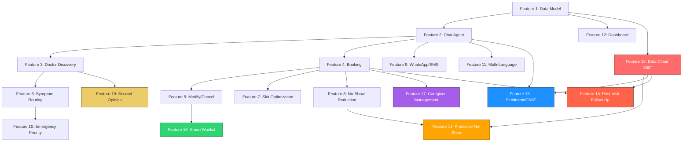

# Feature 19: AI-Powered Cross-Network Second Opinion Routing

## 📚 1. Concept Explanation

**What we are building:**
An intelligent referral and second opinion system that leverages Onco Global's 10-hospital network to connect patients with the **best specialist across ALL locations** — not just their local hospital. When a patient needs a second opinion, the AI agent analyzes their diagnosis, treatment history, and the expertise profiles of providers network-wide to recommend the most qualified specialist, even if they're at a different city.

**Why this is the ultimate differentiator:**
- Shows the **network advantage** of 10+ hospitals — not just individual hospital scheduling
- Demonstrates **cross-org intelligence** — AI that thinks at the network level
- Addresses a deeply emotional need — getting a second opinion in cancer care is critical
- Uses every feature built so far: Data Cloud profiles (F13), symptom routing (F6), smart slots (F7)
- Positions the solution as a **Care Navigation Platform**, not just a booking tool
- Judges will see this as the "10x vision" — this is where the platform could scale

**The Second Opinion Journey:**
```
Patient requests a second opinion
    ↓
AI analyzes: current diagnosis, treatment stage, hospital, doctor seen
    ↓
AI searches ALL 10 hospitals for matching specialist expertise
    ↓
Ranks by: expertise match, experience, patient ratings, availability
    ↓
Presents top 3 options with teleconsult/in-person options
    ↓
Patient chooses → AI transfers records summary → Books appointment
    ↓
Post-consultation: AI links both opinions in care journey
```

---

## 🏗️ 2. Salesforce Setup Steps

### Step 2.1: Create Second Opinion Request Object

#### 🩺 Custom Object: `Second_Opinion_Request__c`

**Purpose:** Tracks every second opinion request through its lifecycle.

**Create the object:**
- **Label:** `Second Opinion Request`
- **Plural Label:** `Second Opinion Requests`
- **Record Name:** `Request ID` (Auto Number, format: `SOR-{00000}`)

**Fields:**

| Field Label | API Name | Data Type | Required | Description |
|------------|----------|-----------|----------|-------------|
| Patient | `Patient__c` | Lookup(Account) | ✅ Yes | The requesting patient |
| Original Provider | `Original_Provider__c` | Lookup(Provider__c) | No | The first doctor |
| Original Department | `Original_Department__c` | Lookup(Department__c) | No | Original department |
| Original Hospital | `Original_Hospital__c` | Lookup(Hospital__c) | No | Where they were first seen |
| Diagnosis | `Diagnosis__c` | Text Area(500) | ✅ Yes | Current diagnosis |
| Treatment Stage | `Treatment_Stage__c` | Picklist | No | Pre-treatment, Active, Post-treatment |
| Reason for Second Opinion | `Reason__c` | Picklist | ✅ Yes | Why they want another opinion |
| Recommended Provider | `Recommended_Provider__c` | Lookup(Provider__c) | No | AI-recommended specialist |
| Recommended Hospital | `Recommended_Hospital__c` | Lookup(Hospital__c) | No | Where the specialist is |
| Consultation Mode | `Consultation_Mode__c` | Picklist | No | In-Person, Teleconsult, Hybrid |
| Status | `Status__c` | Picklist | ✅ Yes | Requested, Matched, Booked, Completed, Declined |
| Match Confidence | `Match_Confidence__c` | Percent(3,0) | No | How well the specialist matches |
| Linked Appointment | `Linked_Appointment__c` | Lookup(Appointment__c) | No | The booked appointment |
| Request Timestamp | `Request_Timestamp__c` | Date/Time | No | When requested |
| Outcome | `Outcome__c` | Picklist | No | Confirmed Original, Changed Plan, New Treatment |
| Patient Notes | `Patient_Notes__c` | Text Area(Long) | No | Patient's specific concerns |

**Picklist Values:**

**Reason__c:**
- Confirming Diagnosis
- Exploring Treatment Options
- Unsatisfied with Current Plan
- Seeking Specialist Expertise
- Family Recommendation
- Complex Case

**Consultation_Mode__c:** In-Person, Teleconsult, Hybrid (Teleconsult + Follow-up In-Person)

**Treatment_Stage__c:** Newly Diagnosed, Pre-Treatment, Active Treatment, Post-Treatment, Remission, Recurrence

**Outcome__c:** Confirmed Original Diagnosis, Modified Treatment Plan, New Treatment Recommended, Referred to Another Specialist

### Step 2.2: Add Expertise Profile Fields to Provider__c

| Field Label | API Name | Data Type | Description |
|------------|----------|-----------|-------------|
| Sub-Specialties | `Sub_Specialties__c` | Text Area(500) | e.g., "HER2+ breast cancer, triple-negative breast cancer" |
| Research Focus | `Research_Focus__c` | Text Area(500) | Active research areas |
| Publications Count | `Publications_Count__c` | Number(4,0) | Academic publications |
| Second Opinion Availability | `Second_Opinion_Available__c` | Checkbox | Accepts second opinion consultations |
| Teleconsult Available | `Teleconsult_Available__c` | Checkbox | Available for video consultations |
| Second Opinion Fee | `Second_Opinion_Fee__c` | Currency(8,2) | Fee for second opinion visits |

### Step 2.3: Populate Provider Expertise Profiles

Update existing providers with sub-specialty data:

| Provider | Sub-Specialties | Research Focus | Teleconsult |
|----------|----------------|---------------|-------------|
| Dr. Priya Sharma | HER2+ breast cancer, hormone therapy, immunotherapy | Targeted therapy for breast cancer | ✅ Yes |
| Dr. Rajesh Patel | IMRT, SBRT, proton therapy, brachytherapy | Advanced radiation techniques | ✅ Yes |
| Dr. Ananya Krishnan | Robotic surgery, minimally invasive, Whipple procedure | Surgical oncology innovations | No |
| Dr. Mohammed Khan | CLL, AML, CAR-T therapy, bone marrow transplant | CAR-T cell therapy research | ✅ Yes |
| Dr. Sunita Reddy | NSCLC, SCLC, immunotherapy, targeted therapy | Lung cancer immunotherapy | ✅ Yes |
| Dr. Vikram Singh | Glioblastoma, meningioma, stereotactic radiosurgery | Brain tumor genomics | ✅ Yes |
| Dr. Meera Nair | Robotic gynecological surgery, BRCA mutations | Hereditary cancer screening | ✅ Yes |
| Dr. Arjun Mehta | Neuroblastoma, Wilms tumor, bone cancer in children | Pediatric immunotherapy | ✅ Yes |

---

## 🤖 3. Agentforce Implementation

### Step 3.1: New Agent Topic — Second Opinion

1. **Topic Name:** `Second Opinion`
2. **Description:** `Handles requests from patients who want a second medical opinion on their diagnosis or treatment plan from a specialist across the Onco Global network.`
3. **Scope / Instructions:**

```
## Second Opinion Protocol

### When to activate this topic:
- Patient says "I want a second opinion"
- Patient says "I want to see another doctor about my diagnosis"
- Patient expresses doubt about their treatment plan
- Patient asks "Is there a specialist for [specific condition]?"

### Flow:

#### Step 1: Empathize & Gather Context
"Getting a second opinion is a wise and common choice in cancer care. 
I'm here to help you find the right specialist.

Could you tell me:
1. Your current diagnosis (e.g., Stage 2 Breast Cancer)
2. Your current treatment (if any)
3. What specifically you'd like a second opinion on
4. Do you prefer an in-person visit or teleconsultation?"

#### Step 2: Find the Best Specialist
- Use Cross_Network_Specialist_Search action
- This searches ALL 10 hospitals for the most qualified specialist
- Exclude the patient's current doctor
- Rank by: sub-specialty match, experience, availability, teleconsult option

#### Step 3: Present Options
"Based on your diagnosis, I've found these specialists across 
our network who have deep expertise in [condition]:

🏆 Top Recommendation:
   Dr. [Name] — [Hospital, City]
   Specialization: [Sub-specialty]
   Experience: [X] years | [X] publications
   Teleconsult: Available ✅
   Fee: ₹[amount]

Would you like to book a consultation?"

#### Step 4: Book & Facilitate
- Book the appointment (in-person or teleconsult)
- Create a Second_Opinion_Request__c record
- Offer to send a summary of their current treatment to the new doctor
- "I'll also prepare a care summary for Dr. [New] so they have 
   full context before your visit."

### Guidelines:
- NEVER discourage a second opinion — it's a patient's right
- Be neutral — don't imply the first doctor was wrong
- Highlight network strengths: "Our network lets you access 
  top specialists without changing hospitals"
```

### Step 3.2: Agent Action — Cross-Network Specialist Search

1. **Action Name:** `Cross_Network_Specialist_Search`
2. **Action Type:** Apex Invocable
3. **Description:** `Search across all 10 Onco Global hospitals for the best matching specialist for a second opinion.`
4. **Inputs:**
   - `patient_id` (String)
   - `diagnosis` (String) — The condition
   - `current_provider_id` (String, optional) — Exclude this doctor
   - `consultation_mode` (String) — In-Person, Teleconsult, Any
5. **Outputs:**
   - `specialist_recommendations` (String) — Formatted ranked list
   - `top_match_provider_id` (String) — Best match provider ID
   - `match_confidence` (Number) — 0-100

---

## 🔄 4. Automation / Logic

### Apex Class: Cross-Network Specialist Finder

```apex
public class CrossNetworkSpecialistFinder {
    
    @InvocableMethod(label='Cross-Network Specialist Search'
                     description='Find the best specialist across all hospitals for a second opinion')
    public static List<SpecialistResult> findSpecialist(List<SpecialistRequest> requests) {
        List<SpecialistResult> results = new List<SpecialistResult>();
        
        for (SpecialistRequest req : requests) {
            SpecialistResult result = new SpecialistResult();
            
            try {
                String diagnosis = req.diagnosis.toLowerCase();
                
                // Extract key terms from diagnosis
                List<String> diagnosisTerms = new List<String>();
                for (String word : diagnosis.split('[,\\s\\.;]+')) {
                    String cleaned = word.trim().toLowerCase();
                    if (cleaned.length() > 2) {
                        diagnosisTerms.add(cleaned);
                    }
                }
                
                // Search all active providers across the network
                String excludeId = req.currentProviderId;
                
                List<Provider__c> allProviders = [
                    SELECT Id, Name, Specialization__c, Sub_Specialties__c,
                           Research_Focus__c, Experience_Years__c,
                           Publications_Count__c, Rating__c,
                           Consultation_Fee__c, Second_Opinion_Fee__c,
                           Languages_Spoken__c, Bio__c,
                           Department__c, Department__r.Name,
                           Hospital__c, Hospital__r.Name, Hospital__r.City__c,
                           Second_Opinion_Available__c, Teleconsult_Available__c,
                           Symptom_Keywords__c
                    FROM Provider__c
                    WHERE Is_Active__c = TRUE
                    AND Second_Opinion_Available__c = TRUE
                    AND Id != :excludeId
                    ORDER BY Experience_Years__c DESC
                ];
                
                // Score each provider
                List<ScoredProvider> scored = new List<ScoredProvider>();
                
                for (Provider__c provider : allProviders) {
                    Decimal score = 0;
                    List<String> matchReasons = new List<String>();
                    
                    // Factor 1: Sub-specialty match (40%)
                    String subSpec = provider.Sub_Specialties__c != null ? 
                        provider.Sub_Specialties__c.toLowerCase() : '';
                    String keywords = provider.Symptom_Keywords__c != null ? 
                        provider.Symptom_Keywords__c.toLowerCase() : '';
                    String specialization = provider.Specialization__c != null ? 
                        provider.Specialization__c.toLowerCase() : '';
                    
                    Integer termMatches = 0;
                    for (String term : diagnosisTerms) {
                        if (subSpec.contains(term) || keywords.contains(term) || 
                            specialization.contains(term)) {
                            termMatches++;
                        }
                    }
                    
                    if (diagnosisTerms.size() > 0) {
                        Decimal matchRate = (Decimal.valueOf(termMatches) / diagnosisTerms.size()) * 100;
                        score += matchRate * 0.40;
                        if (matchRate >= 50) matchReasons.add('🎯 Strong expertise match');
                    }
                    
                    // Factor 2: Experience (20%)
                    Decimal expScore = Math.min(100, (provider.Experience_Years__c != null ? 
                        provider.Experience_Years__c : 0) * 5);
                    score += expScore * 0.20;
                    if (provider.Experience_Years__c >= 15) {
                        matchReasons.add('⭐ ' + provider.Experience_Years__c + ' years experience');
                    }
                    
                    // Factor 3: Research & publications (15%)
                    if (provider.Research_Focus__c != null) {
                        for (String term : diagnosisTerms) {
                            if (provider.Research_Focus__c.toLowerCase().contains(term)) {
                                score += 15;
                                matchReasons.add('📚 Active researcher in this area');
                                break;
                            }
                        }
                    }
                    
                    // Factor 4: Teleconsult availability (10%)
                    if (req.consultationMode == 'Teleconsult' || req.consultationMode == 'Any') {
                        if (provider.Teleconsult_Available__c) {
                            score += 10;
                            matchReasons.add('💻 Teleconsult available');
                        }
                    }
                    
                    // Factor 5: Rating (10%)
                    if (provider.Rating__c != null) {
                        score += (provider.Rating__c / 5.0) * 10;
                    }
                    
                    // Factor 6: Different hospital bonus (5%)
                    // Getting a second opinion from a different hospital is often preferred
                    score += 5;
                    matchReasons.add('🏥 ' + provider.Hospital__r.Name + ', ' + provider.Hospital__r.City__c);
                    
                    if (score > 20) { // Only include meaningful matches
                        ScoredProvider sp = new ScoredProvider();
                        sp.provider = provider;
                        sp.score = score;
                        sp.reasons = matchReasons;
                        scored.add(sp);
                    }
                }
                
                // Sort by score
                scored.sort();
                
                if (!scored.isEmpty()) {
                    String recommendations = '🩺 **Second Opinion Specialists Found:**\n\n';
                    
                    Integer shown = 0;
                    for (ScoredProvider sp : scored) {
                        if (shown >= 3) break;
                        shown++;
                        
                        String badge = '';
                        if (shown == 1) badge = '🏆 TOP RECOMMENDATION';
                        else if (shown == 2) badge = '🥈 Excellent Match';
                        else badge = '🔹 Good Option';
                        
                        recommendations += shown + '. ' + badge + '\n';
                        recommendations += '   👨‍⚕️ **' + sp.provider.Name + '**\n';
                        recommendations += '   📋 ' + sp.provider.Specialization__c + '\n';
                        
                        if (sp.provider.Sub_Specialties__c != null) {
                            recommendations += '   🔬 Focus: ' + sp.provider.Sub_Specialties__c + '\n';
                        }
                        
                        recommendations += '   🏥 ' + sp.provider.Hospital__r.Name 
                            + ', ' + sp.provider.Hospital__r.City__c + '\n';
                        recommendations += '   ⭐ ' + sp.provider.Experience_Years__c + ' years experience\n';
                        
                        if (sp.provider.Second_Opinion_Fee__c != null) {
                            recommendations += '   💰 Second Opinion Fee: ₹' + sp.provider.Second_Opinion_Fee__c + '\n';
                        }
                        
                        if (sp.provider.Teleconsult_Available__c) {
                            recommendations += '   💻 Teleconsult: Available ✅\n';
                        }
                        
                        if (!sp.reasons.isEmpty()) {
                            recommendations += '   💡 ' + String.join(sp.reasons, ' | ') + '\n';
                        }
                        
                        recommendations += '\n';
                    }
                    
                    recommendations += '📊 Match Confidence: ' + scored[0].score.intValue() + '%\n\n';
                    recommendations += 'Would you like to book a consultation with any of these specialists?\n';
                    recommendations += 'I can arrange either an in-person visit or a teleconsultation. 💻';
                    
                    result.specialistRecommendations = recommendations;
                    result.topMatchProviderId = scored[0].provider.Id;
                    result.matchConfidence = scored[0].score.intValue();
                    
                    // Create the second opinion request record
                    Second_Opinion_Request__c sor = new Second_Opinion_Request__c();
                    sor.Patient__c = req.patientId;
                    sor.Diagnosis__c = req.diagnosis;
                    sor.Recommended_Provider__c = scored[0].provider.Id;
                    sor.Recommended_Hospital__c = scored[0].provider.Hospital__c;
                    sor.Status__c = 'Matched';
                    sor.Match_Confidence__c = scored[0].score.intValue();
                    sor.Request_Timestamp__c = DateTime.now();
                    sor.Consultation_Mode__c = req.consultationMode;
                    
                    if (req.currentProviderId != null && req.currentProviderId != '') {
                        sor.Original_Provider__c = req.currentProviderId;
                    }
                    
                    insert sor;
                    
                } else {
                    result.specialistRecommendations = '🤔 I wasn\'t able to find a matching specialist '
                        + 'for your specific diagnosis across our network.\n\n'
                        + 'I recommend:\n'
                        + '1. Speaking with your current doctor about referral options\n'
                        + '2. Connecting with our Care Navigation team for personalized guidance\n\n'
                        + 'Would you like me to connect you with a care coordinator?';
                    result.matchConfidence = 0;
                }
                
            } catch (Exception e) {
                result.specialistRecommendations = 'Error searching specialists: ' + e.getMessage();
                result.matchConfidence = 0;
            }
            
            results.add(result);
        }
        return results;
    }
    
    public class ScoredProvider implements Comparable {
        public Provider__c provider;
        public Decimal score;
        public List<String> reasons;
        
        public Integer compareTo(Object other) {
            ScoredProvider otherSP = (ScoredProvider) other;
            if (this.score > otherSP.score) return -1;
            if (this.score < otherSP.score) return 1;
            return 0;
        }
    }
    
    public class SpecialistRequest {
        @InvocableVariable(label='Patient ID' required=true)
        public String patientId;
        
        @InvocableVariable(label='Diagnosis' required=true)
        public String diagnosis;
        
        @InvocableVariable(label='Current Provider ID')
        public String currentProviderId;
        
        @InvocableVariable(label='Consultation Mode')
        public String consultationMode;
    }
    
    public class SpecialistResult {
        @InvocableVariable(label='Specialist Recommendations')
        public String specialistRecommendations;
        
        @InvocableVariable(label='Top Match Provider ID')
        public String topMatchProviderId;
        
        @InvocableVariable(label='Match Confidence')
        public Integer matchConfidence;
    }
}
```

---

## 🖥️ 5. UI / Experience Layer

### Demo Conversation — Second Opinion Request

```
👤 I've been diagnosed with Stage 2 breast cancer and my 
   doctor recommended mastectomy. I want a second opinion 
   before deciding.

🤖 Seeking a second opinion is absolutely the right thing 
   to do, and we fully support that. 🙏

   Let me find the best specialist across our entire 
   network for your case.

   Could you tell me:
   1. Which doctor are you currently seeing?
   2. Would you prefer an in-person visit or teleconsultation?

👤 Dr. Priya Sharma at Mumbai. I'd prefer teleconsult 
   since I'm not in Mumbai right now.

🤖 Let me search our network of 10 hospitals for the 
   best breast cancer specialist for a teleconsultation...

   🩺 Second Opinion Specialists Found:

   1. 🏆 TOP RECOMMENDATION
      👨‍⚕️ Dr. Sunita Reddy
      📋 Medical Oncology
      🔬 Focus: Immunotherapy, targeted therapy for breast cancer
      🏥 Onco Global North, Delhi
      ⭐ 12 years experience
      💰 Second Opinion Fee: ₹2,500
      💻 Teleconsult: Available ✅
      💡 🎯 Strong expertise match | 📚 Active researcher

   2. 🥈 Excellent Match
      👨‍⚕️ Dr. Meera Nair
      📋 Gynecological Oncology
      🔬 Focus: BRCA mutations, hereditary cancer screening
      🏥 Onco Global South, Bangalore
      ⭐ 16 years experience
      💰 Second Opinion Fee: ₹3,000
      💻 Teleconsult: Available ✅
      💡 🎯 Strong expertise match | ⭐ 16 years experience

   📊 Match Confidence: 78%

   Would you like to book a teleconsultation with 
   Dr. Sunita Reddy? I'll also prepare a summary of 
   your current treatment for her review.

👤 Yes, let's go with Dr. Reddy

🤖 [Proceeds with booking flow]
   
   ✅ Teleconsultation Booked!
   📋 APT-0020 | Second Opinion
   👨‍⚕️ Dr. Sunita Reddy
   📅 Monday, May 5 at 03:00 PM
   💻 Mode: Video Teleconsultation
   
   📋 I've also prepared a care summary for Dr. Reddy 
   including your diagnosis and current treatment plan.
   
   She'll review it before your consultation so you can 
   make the most of your time together.
   
   Is there anything else I can help with?
```

---

## 🧪 6. Testing

| Test | Input | Expected Result |
|------|-------|-----------------|
| Breast cancer search | "Stage 2 breast cancer" | Matches breast cancer specialists (not current doctor) |
| Cross-city match | Patient in Mumbai, specialist in Delhi | Delhi specialist recommended with teleconsult |
| Teleconsult filter | Mode = Teleconsult | Only teleconsult-available doctors shown |
| No match | Very rare diagnosis | Graceful fallback: "Connect with care coordinator" |
| Record creation | Complete second opinion request | `Second_Opinion_Request__c` record created |
| Exclude current doctor | Patient of Dr. Sharma | Dr. Sharma NOT in recommendations |
| Booking integration | Book second opinion appointment | Appointment type = "Second Opinion" |
| Outcome tracking | After consultation | `Outcome__c` can be updated |

---

## 🎯 Summary

After completing Feature 19:
- ✅ `Second_Opinion_Request__c` lifecycle tracking object
- ✅ Enhanced Provider profiles with sub-specialties and research focus
- ✅ Cross-network specialist matching algorithm (6 weighted factors)
- ✅ Teleconsult support for remote second opinions
- ✅ Care summary preparation for the consulting specialist
- ✅ New "Second Opinion" agent topic with empathetic scripts
- ✅ Outcome tracking (Confirmed Original / Changed Plan / New Treatment)
- ✅ Integrated with booking engine for seamless appointment creation

---

## 🏆 Complete Feature Map (Features 1-19)



**The solution now covers the COMPLETE patient lifecycle:**
Discovery → Booking → Pre-Visit → Visit → Post-Visit → Follow-Up → Second Opinion → Repeat
